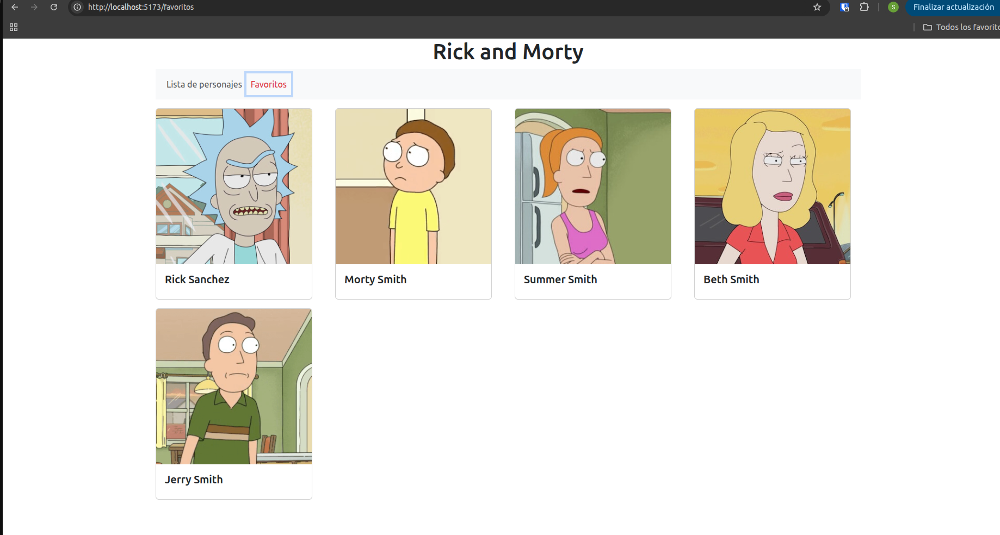

# 🛸 Rick and Morty Favoritos

Esta es una aplicación construida con **React** que permite buscar personajes de la serie **Rick and Morty**, visualizarlos con estilo y agregarlos a una lista de **favoritos**. Se basa en el uso de rutas, componentes reutilizables y peticiones a una API usando Axios.

---

## 🚀 Tecnologías utilizadas

- ⚛️ React  
- 📦 Axios – para obtener los personajes desde la [Rick and Morty API](https://rickandmortyapi.com)  
- 🧭 React Router – para navegación entre páginas  
- 💅 React-Bootstrap – para el diseño moderno y responsivo  
- 📄  Html

---

## 📋 Funcionalidades principales

- 🔍 Buscar personajes por nombre
- 🖼️ Mostrar los personajes en tarjetas (cards) con su imagen, especie y estado
- ⭐ Marcar o desmarcar personajes como **favoritos**
- ❤️ Ver una sección solo con tus personajes favoritos
- 📁 Rutas dinámicas como `/character/:id` para ver más información
- ⚡ Interfaz rápida y amigable

---

## 🧪 ¿Cómo se usa?

1. Ve a la página principal (`/`)
2. Busca personajes por su nombre
3. Haz clic en "Agregar a Favoritos"
4. Accede a la ruta `/favoritos` para verlos todos

---

## 📸 Visualización del proyecto

